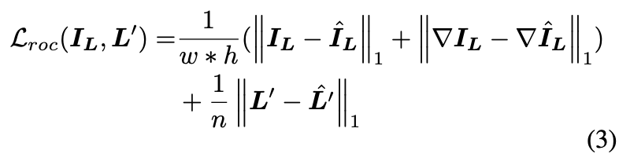
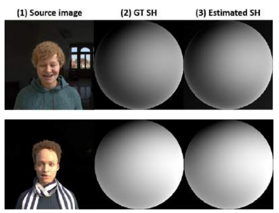

## Relighting Images in the Wild With a Self-Supervised Siamese Auto-Encoder

### WACV 2021

---

Yang Liu, Alexandros Neophytou, Sunando Sengupta, Eric Sommerlade

University of Surrey and Microsoft, Reading.

---

#### Resources

[paper](https://openaccess.thecvf.com/content/WACV2021/html/Liu_Relighting_Images_in_the_Wild_With_a_Self-Supervised_Siamese_Auto-Encoder_WACV_2021_paper.html)

---

#### Research Goal

A self-supervised method for relighting of single view images in the wild. 

---

#### Prior Work  

- Human faces (masked):
  - Estimating surface normals based on an SFSNet network (a framework for decomposing face images into shape, reflectance and illuminance)
  - Jointly estimating facial features and lighting features

---

#### Prior Work  

- Environment images:
  - Most of the previous works need 2D/3D geometric priors or RGB-D sensors
- Photo style transfer:
  - GANs widely used (pix2pix, CycleGAN)

---

#### Key Idea

- Train an auto-encoder which decomposes an image into two embeddings: 
  - illumination
  - content

- Motivation: 
  - labelled datasets for supervised learning techniques are hard to attain.

---

#### Challenge 1

How can we separate illumination from content?

---

#### Challenge 1: Solution

Augmenting images such that geometry remains the same but lighting direction changes.

- Flip images
- Rotate images
- Invert images

Pair up augmented image with original image and train a Siamese auto-encoder network.

---

#### Challenge 2

How can we generate a semantically meaningful light representation?

---

#### Challenge 2: Solution

Design a spherical harmonic loss to force the illumination embedding to take the form of Laplace's spherical harmonics.

In this way, the lighting can be meaningfully controlled.

---

## Method

---

#### Relighting Auto-encoding

If target and source illumination embeddings are the
same, the network becomes a reconstruction network.
Otherwise, it is a relighting network.

---

Three objective functions are used to train the autoencoder:

- reconstruction loss
- Spherical Harmonic loss 
- discriminator loss

---

#### Reconstruction loss

There is no ground truth illumination embedding, so a siamese network is used to compute the reconstruction loss.

The auto-encoders are identical and share weights. 

---

#### Reconstruction loss

- Mean absolute error (MAE) is computed between the images and illumination embeddings. 
- MAE also computed over image gradients to preserve edges.

---

#### Spherical Harmonic loss

- Reconstruction loss alone can't guarantee that the network can relight images 
- A loss function based on Spherical Harmonics is introduced
  - constrains the illumination embedding

---

#### Spherical Harmonic lighting

$b$ is the bias and its value is set to $\frac{\sqrt{\pi}}{2}$

$X,Y,Z$ means the channels are linearly dependent on the respective axis.

---

#### Spherical Harmonic lighting

Spherical Harmonics of the training data is unknown, BUT we do know how they change when the image is rotated/flipped/inverted.

---

#### Spherical Harmonic loss

$A$ is an adapted version of $I_L$. 

Spherical Harmonic loss is computed over $\hat{L}$ and $\hat{L}_A$.

---

#### Spherical Harmonic loss

---

#### Discriminator loss

They argue that image flipping etc. may introduce artifacts.

A GAN loss is added to improve the quality of the generated images.

The GAN is used to force the distribution of local image patches to be close to that of a natural image.

---

#### Overall loss

---

#### Implementation details

- Image resolution 1024 x 1024
- Network consists of downsampling/upsampling layers with residual blocks and skip connections, and fully connected layers to get content and illumination embeddings

---

#### Experiments

- Datasets
  - CelebA (train + test)
  - Youtube 8M (train + test)
  - Synthetic faces (test only)
- Metrics
  - RMSE
  - Structural dissimilarity (DSSIM)
  - Scale-invariant RMSE (RMSE-s)

---

#### Ablation Experiments

  
   

---

#### Results

  
   

---

#### Results

---

#### Comparison to State of the Art

---

# Questions

