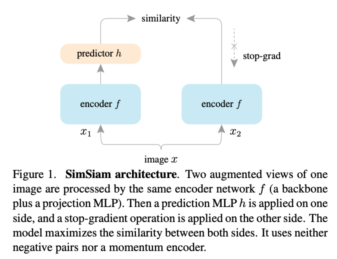

## Barlow Twins: Self-Supervised Learning via Redundancy Reduction

### ICML 2021 (arXiv preprint)

---

Jure Zbontar, Li Jing, Ishan Misra, Yann LeCun and Stephane Deny 

Facebook AI Research and New York University, NY, USA

---

#### Resources

[paper](https://arxiv.org/pdf/2103.03230.pdf)

[code and models](https://github.com/facebookresearch/barlowtwins)

---

#### Research Goal

Self-supervised representation learning from images

- No human annotation
- Learns useful features

---

#### Prior Work  

- Standard SSL framework learns features that are invariant under different distortions:
  1. Randomly distort image twice (data augmentation)
  2. Train siamese network to maximise cosine similarity between pairs of embedded distorted images 

---

#### Prior Work - Siamese Networks

- However, trivial solutions (eg. a constant representation) solve this problem

---

#### Prior Work - Contrastive Learning

- Contrastive learning approaches define positive and negative sample pairs 
  - Eg. SimCLR
  - Large number of negative samples required
  - Very large batch sizes typically required

---

#### Prior Work - Asymmetric architectures

- Both network architecture and parameter updates are modified to introduce asymmetry
  - eg. BYOL (momentum encoder), SimSiam (stop-gradients, projector)

---

#### Prior Work - SIMSIAM

---

#### Key Goals

- A representation learning approach that doesn't require large batches, negative samples, momentum encoders, stop gradients etc.

- Aim to achieve representation that has statistically independent components
  - The cross correlation matrix of the two embedded samples is close to identity

---

#### Barlow Twins

---

#### Key Contribution

---

#### Observations 

- The method does not require negative samples 
- Can be trained with small batch sizes
- Benefits from high-dimensional embeddings

---

#### Implementation - Augmentations

- Always applied:
  - Random crop and resize (224x224)
- Randomly applied: 
  - Horizontal flipping, colour jitter, grayscale, Gaussian blur, solarisation.

---

#### Implementation - Architecture

- ResNet-50 backbone (outputs representation)
- Projector network with 3 linear layers with batch norm and ReLU activations (outputs embeddings)

---

#### Implementation - Architecture

- LARS optimiser
- 1000 epochs, batch size **2048**, 32 GPUs, 124 hours...

---

#### Experiments

- Model pre-trained on ImageNet and evaluated on benchmark tasks:
  - Image classification
  - Object detection

---

#### Results

---

#### More Results

  
   

---

#### Ablation - Batch size

---

#### Ablation - Augmentation

---

#### Ablation - Dimensionality

---

# Questions

